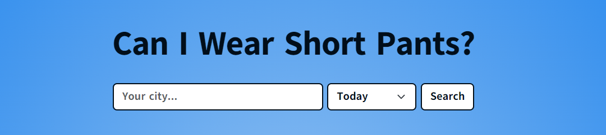

# Can I wear short pants?

## Description

Can I wear short pants? is a React-based frontend application that uses the Visual Crossing weather API to retrieve data about the temperature, weather, humidity and a time and place specified by the user. Based on this information the application displays a response to the question "Can I wear short pants?".

## Deployment link

https://can-i-wear-short-pants.netlify.app/

## Timeframe & Working Team

This project was created within 3 days of work by two people.
Collaborator: NLie2

## Technologies used

- React
- JavaScript
- Sass
- Node.js
- Express
- Git
- GitHub
- Visual crossing weather API: https://www.visualcrossing.com/resources/documentation/weather-api/timeline-weather-api/ 
- Netlify

## Brief

The app must:
​
- Consume a public API – this could be anything but it must make sense for your project
- Have several components
- The app can have a router - with several "pages", this is up to you and if it makes sense for your project
- Include wireframes - that you designed before building the app
- Be deployed online and accessible to the public

## Planning

The initial planning of the project started with the idea of using a weather API and a basic wireframe created with Excalidraw.

We made sure to structure our wireframe in such a way that we could work relatively independently on different components to reduce merge conflicts to a minimum. For that we created all necessary components in the beginning of our project and implemented the data from the API. As Nathalie has experience in working with APIs we decided for her to work on displaying the details about the weather, and as I was interested in strengthening my knowledge about search functions I started with that.

## Build/Code Process

Before starting with this project we did enough research to be completely sure about how our chosen API works and what exact data we can request so it aligns with our wireframe.

For this first pair project we delegated clearly what tasks each of us were responsible for. Nathalie set up the base of the project so we could implement and test the API.

To structure our content and in order to secure the responsiveness of our application we decided to implement Bootstrap.

I started to work on the search function which contains the possibility to specify a location and a date within the next 14 days. In case the user forgets to select a date, I defined today as the default value.

The displayed answer depends on the temperature in the selected location.

After being unsure of how to pass information between components to be able to implement the "Take me to the sun" button we decided to work on a shared screen.

## Challenges

This was the first time for both of us working with forks on GitHub so we initially had some problems with pushing and pulling our versions.

Sometimes sharing variables with different components proved to be quite difficult. For instance, the "Take me to the sun" button is supposed to access a random city, and check if the temperature there is hotter than at the place currently displayed, and then display the new place if it is hotter. However, the display functionality cannot easily be accessed by the button component, which is why we solved it by passing a boolean down to the button, that if it was set to true, would lead to the App.js component checking the temperature of the new place.

## Wins

The collaboration with Nathalie worked well and we managed to fix all merge conflicts we came across.
Another win are the great working functionalities and the simple but fun visual appearance of our app.

## Key Learnings/Takeaways

An interesting learning for both of us during this project was to always comment our own code as much as possible to make the reasons for our choices as understandable to our collaborator as possible. 
There was one instance during this project in which Nathalie refactored my code only for us to figure out later that this broke some functionalities.

In general the project gave me a much better understanding of how React works and how to provide information between different components. It was also the first time for me to use environment variables to set a secret API key.

## Bugs

No bugs known.

## Future Improvements

- A more elaborate algorithm to determine the final answer (right now it is based on a simple temperature cutoff)
- Find sunnier places in immediate proximity (right now a random place out of the top hottest places on earth is chosen)
- Implement Spinner while content is loading